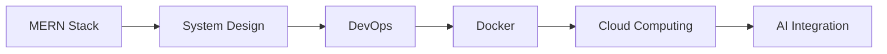

<div align="center">

# Abu Bakar Siddique

### Building Digital Products That Solve Real Problems


<br>

<a href="https://iamabubakar.site">

</a>

<a href="https://www.linkedin.com/in/abubakar0320">

</a>

<a href="mailto:abubakr.bgnu@gmail.com">

</a>

</div>

---

# Developer Dashboard

| | |
|---|---|
| Name | Abu Bakar Siddique |
| Education | BS Information Technology |
| University | Baba Guru Nanak University |
| CGPA | 3.42 / 4.00 |
| Role | Full Stack Developer |
| Focus | MERN Stack |
| Interests | DevOps, Cloud, AI |
| Status | Building & Learning Daily |

---

# Current Mission

```txt
✓ Build Production Ready Applications
✓ Contribute More To Open Source
✓ Master MERN Stack
✓ Learn Cloud Technologies
✓ Learn DevOps & CI/CD
✓ Grow As A Software Engineer
```

---

# Tech Arsenal

### Frontend


### Backend


### Databases


### Tools


---

# Live Products

## EstateHub

Property & Rental Management Platform

🌍 https://estatehub.site

---

## Jamia Sher Rabbani

Educational Management Platform

🌍 https://jamiashererabbani.com

---

## DiabetFree Pakistan

Healthcare Awareness Platform

🌍 https://diabetfreepakistan.site

---

## Portfolio

🌍 https://iamabubakar.site

---

# Open Source Journey

### Filehub Client

Contribution Highlights:

- Added `.env.example`
- Improved Documentation
- Improved Setup Experience
- Enhanced Quick Start Guide

Pull Request:

https://github.com/Anish570/Filehub-Client/pull/2

---

# Learning Roadmap



---

# GitHub Performance

<p align="center">

</p>

<p align="center">

</p>

<p align="center">

</p>

---

# Philosophy

```javascript
while(alive){
    learn();
    build();
    improve();
    shareKnowledge();
}
```

---

<div align="center">

### "Code. Learn. Build. Repeat."

</div>
