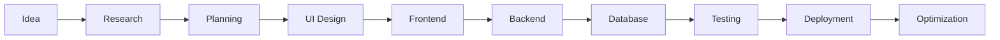
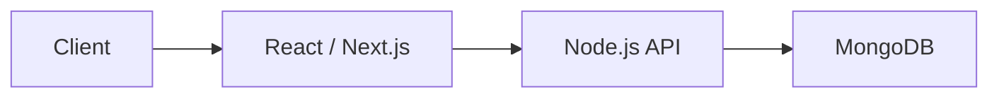
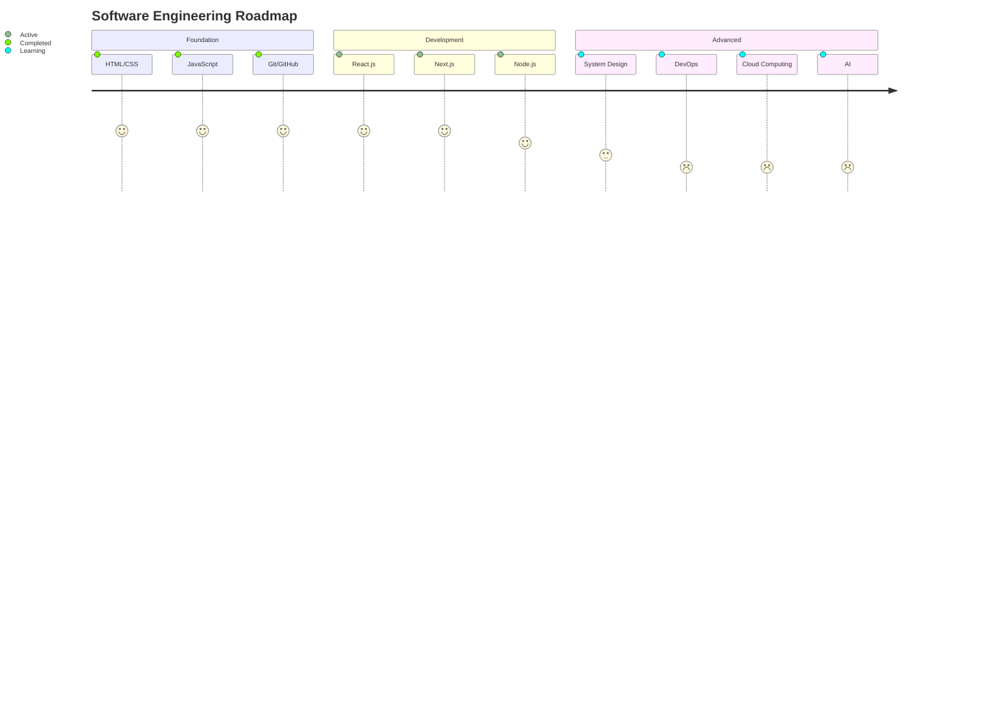

<div align="center">

# Abu Bakar Siddique


<br>

<a href="https://iamabubakar.site">

</a>

<a href="https://www.linkedin.com/in/abubakar0320">

</a>

<a href="mailto:abubakr.bgnu@gmail.com">

</a>

<a href="https://github.com/abubakar0320">

</a>

<br><br>


</div>

---

# 👨‍💻 Developer Profile

```yaml
Name: Abu Bakar Siddique

Role:
  - Full Stack Developer
  - MERN Stack Developer
  - Open Source Contributor

Education:
  Degree: BS Information Technology
  University: Baba Guru Nanak University
  CGPA: 3.42 / 4.00

Skills:
  - React.js
  - Next.js
  - Node.js
  - Express.js
  - MongoDB
  - MySQL
  - PHP

Learning:
  - DevOps
  - Docker
  - Cloud Computing
  - System Design
  - Artificial Intelligence

Mission:
  Build software that solves real-world problems.
```

---

# 🚀 About Me

I am a passionate Full Stack Developer currently pursuing a BS in Information Technology.

My focus is building modern, scalable, and production-ready applications using React, Next.js, Node.js, MongoDB, PHP, and MySQL.

I enjoy transforming ideas into real digital products, contributing to open source, and continuously improving my software engineering skills.

---

# 🛠️ Technology Stack

## Frontend

<p align="center">

</p>

## Backend

<p align="center">

</p>

## Database

<p align="center">

</p>

## Tools & Platforms

<p align="center">

</p>

---

# ⚙️ Development Workflow



---

# 🏗️ Application Architecture



---

# 📂 Featured Projects

## 🏠 EstateHub

### Smart Property & Rental Management System

**Tech Stack**

- React.js
- Node.js
- MongoDB

**Features**

- Property Listings
- Rental Management
- Authentication System
- Dashboard Analytics
- Responsive Design

🌐 https://estatehub.site

---

## 🕌 Jamia Sher Rabbani

### Educational & Institutional Management Portal

**Tech Stack**

- React.js
- Node.js
- MongoDB

**Features**

- Admin Dashboard
- User Authentication
- Dynamic Content Management
- User Management

🌐 https://jamiashererabbani.com

---

## 🏥 DiabetFree Pakistan

### Healthcare Awareness Platform

**Tech Stack**

- Next.js
- Node.js
- MongoDB

**Features**

- SEO Optimized
- Fast Performance
- Responsive Design
- Healthcare Resources

🌐 https://diabetfreepakistan.site

---

## 🌐 Personal Portfolio

Professional portfolio showcasing projects, skills, and achievements.

🌐 https://iamabubakar.site

---

# 🌟 Open Source Contributions

## Filehub Client

Contribution Highlights:

- Added `.env.example`
- Improved Setup Process
- Enhanced Documentation
- Improved Quick Start Guide

🔗 https://github.com/Anish570/Filehub-Client/pull/2

---

# 🏆 Certifications

- Cisco Certified in Cybersecurity
- Networking Fundamentals
- Git & GitHub
- Modern Web Development

---

# 📈 Current Learning Roadmap



---

# 🎯 Current Goals

- Build Production Ready Applications
- Master MERN Stack
- Learn Advanced System Design
- Contribute More To Open Source
- Learn Cloud Technologies
- Explore Artificial Intelligence

---

# 📊 GitHub Statistics

<p align="center">


</p>

---

# 🔥 GitHub Streak

<p align="center">

</p>

---

# 📈 Contribution Activity

<p align="center">

</p>

---

# 🏅 GitHub Achievements

<p align="center">

</p>

---

# 🐍 Contribution Snake

<p align="center">

</p>

---

# 💡 Development Philosophy

```javascript
while (alive) {
    learn();
    build();
    improve();
    contribute();
    repeat();
}
```

---

# 📫 Connect With Me

<p align="center">

<a href="https://iamabubakar.site">

</a>

<a href="https://www.linkedin.com/in/abubakar0320">

</a>

<a href="mailto:abubakr.bgnu@gmail.com">

</a>

</p>

---

<div align="center">

### 🚀 Building software that solves real-world problems and creates meaningful impact.

</div>
